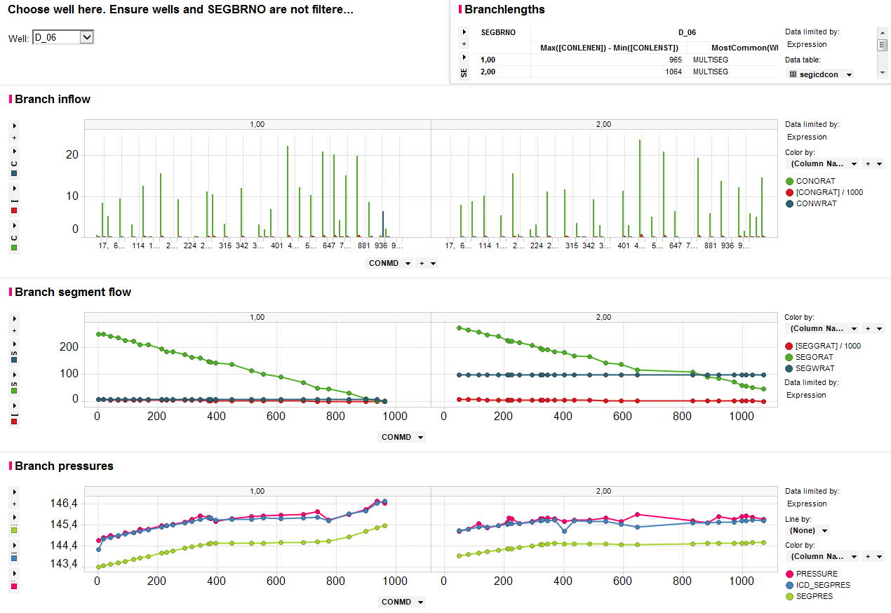
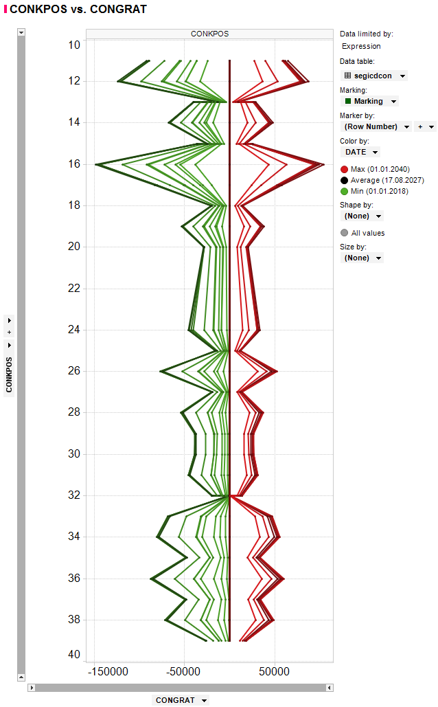

rft
---

rft will convert the binary RFT files from Eclipse to dataframes or CSV files,
facilitating analysis of inflow and pressure for each connection the well
has to the reservoir grid.

Typical usage is to generate the CSV from the command line:

.. code-block:: console

  ecl2csv rft MYDATADECK.DATA --verbose --output rft.csv

It is possible to a specific well, a date (YYYY-MM-DD). If you enable debug mode
through ``--debug``, more information is printed, including an ASCII representation
of each wells topology, and also three extra CSV files printed for the last
processed well.

Eclipse usage
^^^^^^^^^^^^^

In order to get RFT files emitted from Eclipse, you need the ``WRFTPLT`` keyword
in your DATA-file, example:

.. code-block:: console

  WRFTPLT
    '*' 'REPT' 'REPT' 'REPT' /
  /

where ``*`` will match all wells defined up to this point.

From RMS11, you can insert

.. code-block:: console

  YYYY-MM-DD IORFT NAME='*' PLTFREQ='Yes' RFTFREQ='Yes' SEGFREQ='Yes'

into your events files to obtain the same (input a date in your
specified date format).

Segment and ICD analysis
^^^^^^^^^^^^^^^^^^^^^^^^

For multisegment wells, reservoir connections (``CONxxxxx`` data) are matched
to their corresponding well segment (``SEGxxxxx`` data) and the matched data is
returned on the same row in the CSV file, facilitating cross-plot of data.

When ICD segments are detected (well segments that sit alone on their own
branch), these data are tagged with an ``ICD_`` prefix to their ``SEGxxxxx``
columns, and also matched to the row with the connection and segment data.
This facilitates analysis of f.ex. pressure drop from the reservoir, in the ICD,
and in the tubing.

Limitations
^^^^^^^^^^^

Each segment must correspond to no more than one reservoir connection. This is the
recommended way to model multisegment wells.

Segments not related to a reservoir connection are not included in the outputted
CSV file.

Analysis examples
^^^^^^^^^^^^^^^^^

Example illustrating inflow analysis of a two-branch well in a visual tool for
tabular data. From the data in the emitted CSV, branch lengths can be computed,
inflow pr. phase can be plotted versus segment index or depth, or phase flow
in the tubing versus the same. Pressure drop from reservoir cell to tubing
can be analyzed. In this image, the data is filtered to a specific date.

Vertical injector/producer analysis for a gas injector that is later converted
to a producer for the blowdown period (date indicated by colour). Gas inflow/outflow
plotted versus grid ``k``-index. This if for a non-multisegment well, and
no segment data is available.

Column names
^^^^^^^^^^^^

.. csv-table:: Column names and explanations
   :file: rft_columns.csv
   :header-rows: 1

If addition, if you have branches with only one segment, these will be assumed
to represent ICD segments. The corresponding ``SEG*`` data for these ICD segments
will be joined to the segment they are connected to, and have their ``SEG*`` data
renamed to ``ICD*``. For understanding your ``ICD*`` data, look at the description of
the analogue ``SEG*`` data above.

